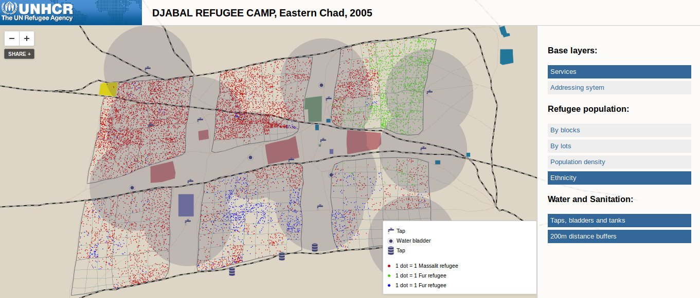

 ## About this repository

This repository illustrates how to visualize interactively various geographical information layers produced within the context of UNHCR operations in Eastern Chad, December 2006.

This micro-site is based on MapBox hosted layers produced with TileMill. 

[The site is accessible here:](http://franckalbinet.github.com/refugee_camp_mapping/)
